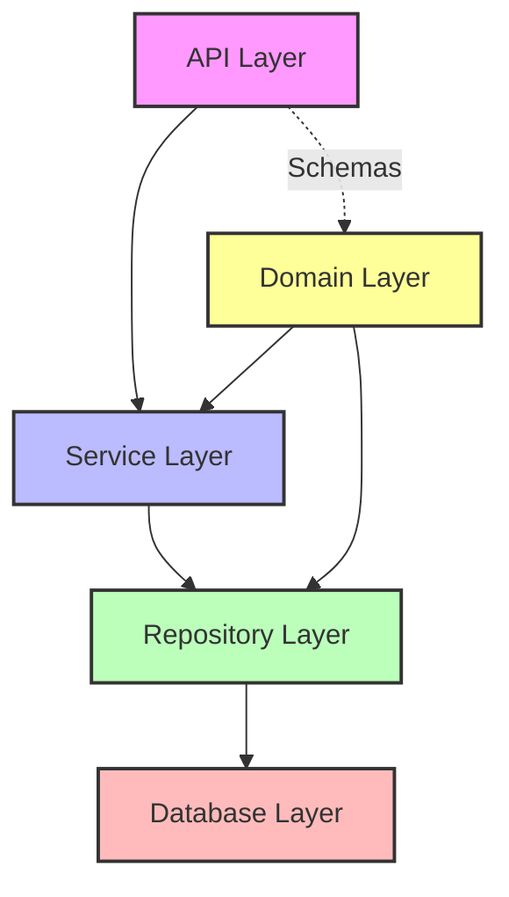

# Documentação do Projeto Flask com Clean Architecture 
# API de Produtos com Flask e SQLite3

[](https://flask.palletsprojects.com/)
[](https://www.sqlite.org/)
[](https://blog.cleancoder.com/uncle-bob/2012/08/13/the-clean-architecture.html)

Este projeto implementa uma API RESTful para gerenciamento de produtos (CRUD), seguindo os princípios de Clean Architecture, utilizando Flask como framework web e SQLite3 como banco de dados.

## Estrutura do Projeto

```
product_service/
├── .env                    # Variáveis de ambiente
├── .gitignore              # Arquivos ignorados pelo Git
├── requirements.txt        # Dependências do projeto
├── README.md               # Este arquivo
├── run.py                  # Ponto de entrada da aplicação
├── config.py               # Configurações da aplicação
│
├── app/                    # Módulo principal da aplicação
│   ├── __init__.py         # Inicialização da aplicação
│   ├── extensions.py       # Configuração das extensões do Flask
│   │
│   ├── api/                # Camada de API (Controllers)
│   │   ├── __init__.py
│   │   └── resources/
│   │       ├── __init__.py
│   │       └── product_resource.py  # Endpoints de produtos
│   │
│   ├── domain/             # Camada de Domínio
│   │   ├── __init__.py
│   │   ├── models/         # Entidades de domínio
│   │   │   ├── __init__.py
│   │   │   └── product.py  # Modelo de Produto
│   │   └── schemas/        # Esquemas de validação
│   │       ├── __init__.py
│   │       └── product_schema.py
│   │
│   ├── services/           # Camada de Serviços (Use Cases)
│   │   ├── __init__.py
│   │   └── product_service.py  # Lógica de negócios
│   │
│   ├── repository/         # Camada de Repositório
│   │   ├── __init__.py
│   │   ├── base_repository.py     # Interface base para repositórios
│   │   └── product_repository.py  # Implementação para produtos
│   │
│   └── database/           # Camada de Infraestrutura
│       ├── __init__.py
│       ├── db.py           # Configuração do SQLite
│       └── migrations/     # Scripts de migração
│
└── tests/                  # Testes unitários e de integração
    ├── __init__.py
    ├── conftest.py         # Configurações dos testes
    ├── test_product_api.py
    ├── test_product_service.py
    └── test_product_repository.py
```

## Arquitetura do Projeto

Este projeto segue os princípios da Clean Architecture, separando claramente as responsabilidades em camadas:



### Explicação das Camadas

1. **API Layer (Controllers)**: Gerencia as requisições HTTP e respostas, utilizando Flask-RESTful.
2. **Service Layer (Use Cases)**: Contém a lógica de negócios e orquestra o fluxo da aplicação.
3. **Repository Layer**: Interface para acesso a dados, abstraindo o mecanismo de persistência.
4. **Database Layer**: Implementação específica do banco de dados (SQLite3).
5. **Domain Layer**: Define as entidades do negócio e regras de validação.

### Fluxo de Dados

1. Uma requisição chega no endpoint REST (`ProductResource`)
2. A camada API valida os dados de entrada usando schemas
3. A requisição validada é passada para a camada de serviço (`ProductService`)
4. O serviço executa a lógica de negócios e utiliza o repositório (`ProductRepository`)
5. O repositório interage com o banco de dados SQLite
6. A resposta segue o caminho inverso, sendo serializada antes de retornar ao cliente

## Requisitos

- Python 3.8+
- Flask 2.0+
- SQLAlchemy 1.4+
- Flask-RESTful
- Marshmallow
- python-dotenv

## Como Rodar o Projeto

### 1. Configuração do Ambiente

```bash
# Clone o repositório
git clone https://github.com/seu-usuario/product-service.git
cd product-service

# Crie um ambiente virtual
python -m venv venv
venv\Scripts\activate  # Windows
source venv/bin/activate  # Linux/Mac

# Instale as dependências
pip install -r requirements.txt
```

### 2. Configuração do Banco de Dados

```bash
# Crie as variáveis de ambiente (ou edite o arquivo .env)
echo "FLASK_APP=run.py" > .env
echo "FLASK_ENV=development" >> .env
echo "DATABASE_URL=sqlite:///app.db" >> .env

# Inicialize o banco de dados
flask db init
flask db migrate -m "Initial migration"
flask db upgrade
```

### 3. Iniciar o Servidor

```bash
# Inicie o servidor de desenvolvimento
flask run
```

A API estará disponível em `http://localhost:5000/api/v1/products`

## Endpoints da API

| Método | URL | Descrição |
|--------|-----|-----------|
| GET | /api/v1/products | Lista todos os produtos |
| GET | /api/v1/products/{id} | Retorna um produto específico |
| POST | /api/v1/products | Cria um novo produto |
| PUT | /api/v1/products/{id} | Atualiza um produto existente |
| DELETE | /api/v1/products/{id} | Remove um produto |

## Exemplo de Uso

### Criar um produto

```bash
curl -X POST http://localhost:5000/api/v1/products \
  -H "Content-Type: application/json" \
  -d '{"name": "Smartphone", "description": "Smartphone XYZ", "price": 999.99, "stock": 50}'
```

### Listar produtos

```bash
curl -X GET http://localhost:5000/api/v1/products
```

## Executando Testes

```bash
# Execute todos os testes
pytest

# Execute com relatório de cobertura
pytest --cov=app
```

## Princípios de Design Aplicados

- **Single Responsibility Principle**: Cada classe tem uma única responsabilidade
- **Dependency Inversion**: Camadas de alto nível não dependem das implementações de baixo nível
- **Interface Segregation**: Interfaces específicas para cada tipo de cliente
- **Separation of Concerns**: Separação clara entre API, lógica de negócios e persistência

## Licença

Este projeto está licenciado sob a licença MIT - veja o arquivo [LICENSE](LICENSE) para mais detalhes.